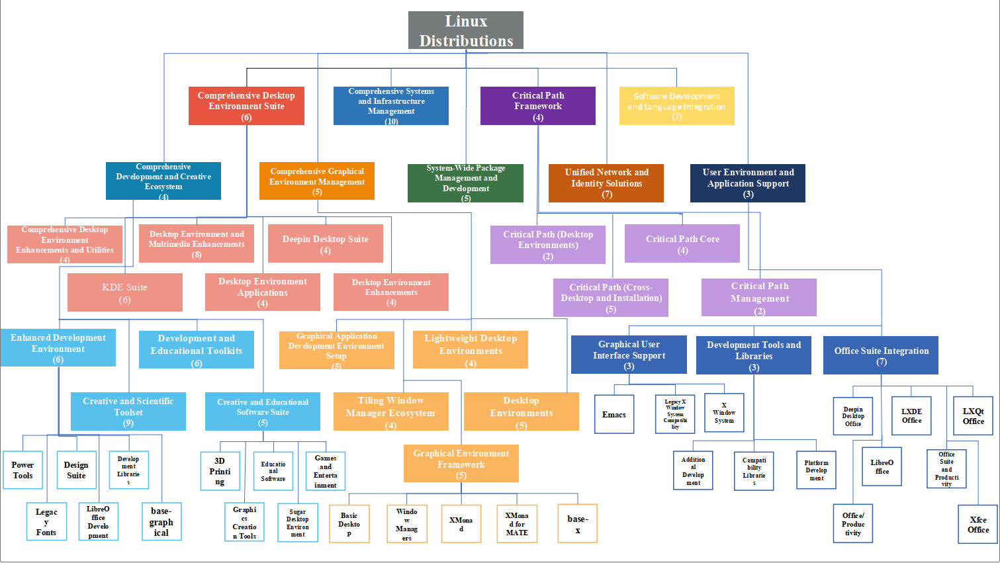

# TreeRec

## Dataset Description

The dataset is organized into three distinct parts, corresponding to three representative open-source ecosystems: **HuggingFace (HF)**, **JavaScript (JS)**, and **Linux**. Each ecosystem's dataset directory contains four JSON files: `candidate.json`, `dataset.json`, `test.json`, and `train.json`.

- `candidate.json`: This file includes all available artifacts within the ecosystem, where each artifact is represented by its `name` and a textual `description`.
- `dataset.json`: This file contains pairs of human-written user requirements (`requirement`) and the corresponding `artifact` name that fulfills the requirement.
- `test.json` and `train.json`: These files provide standard splits for evaluating the performance of retrieval or recommendation models, with `train.json` for training and `test.json` for evaluation.

This structured organization ensures a consistent and comprehensive setup for exploring retrieval and recommendation tasks across multiple ecosystems.

## Constructed Tree for Linux

